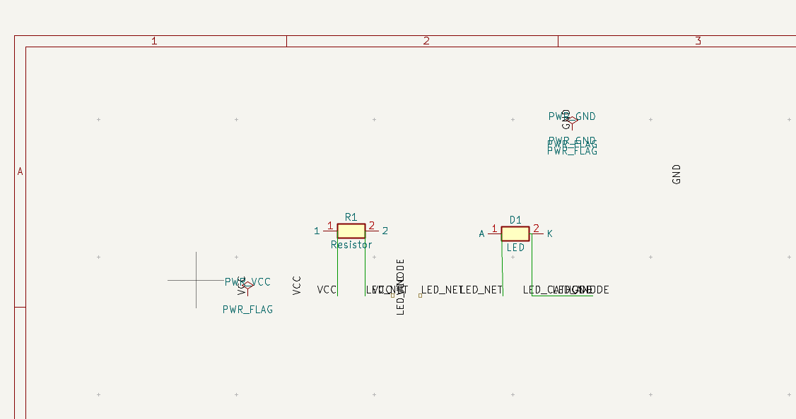

# MCP Server Learning Lab

This repository is a collection of Model Context Protocol (MCP) server implementations designed for educational purposes and practical utility. It demonstrates how to extend AI capabilities by exposing tools, resources, and prompts to AI clients using the [FastMCP](https://github.com/modelcontextprotocol/fastmcp) library.

## Subprojects

### KiCad Agent Workflow

The `kicad_agent/AGENTS.md` file defines a set of guidelines and fallback strategies for working with KiCad MCP tools. Following these guidelines helps improve the reliability and automation of MCP tasks when developing KiCad‑based workflows.

This repository contains several independent MCP server implementations:

### [KiCad MCP Server](./kicad_mcp)
Provides ERC checks and export commands (3D PDF, drill, Gerber, etc.) for KiCad schematics and PCBs.

### [GNews API MCP Server](./news_mcp_server)
A server that provides real-time access to global news via the [GNews API](https://gnews.io/).
- **Key Tools:** `search_news` (with advanced logical operators) and `get_top_headlines`.
- **Resources:** Provides metadata on supported languages, countries, and query syntax.
- **Ideal for:** Research tasks, trend monitoring, and staying updated on specific topics.

### 🧪 [Mock MCP Server](./mock_mcp_server)
A lightweight mock server used for testing and development of MCP clients without needing external APIs or heavy dependencies.
---

## What is MCP?

Model Context Protocol (MCP) is an open protocol that standardizes how AI applications connect to external tools and data sources. MCP servers expose:

- **Tools:** Executable functions that can be called by AI clients.
- **Resources:** Data sources for context (files, APIs, etc.).
- **Prompts:** Reusable templates for interactions.

Learn more at [modelcontextprotocol.io](https://modelcontextprotocol.io/).

## Getting Started

Since this repository contains multiple projects, please navigate to the specific subproject directory for installation and usage instructions:

- For KiCad: `cd kicad_mcp`
- For GNews: `cd news_mcp_server`
- For Mock Server: `cd mock_mcp_server`

## References

- [MCP Specification](https://modelcontextprotocol.io/specification/2025-06-18/index)
- [FastMCP Python Library](https://github.com/modelcontextprotocol/fastmcp)
- [Example Servers](https://modelcontextprotocol.io/examples)

---
**Note:** These examples are for educational purposes. Always review server code and tool definitions before connecting them to your AI applications.
